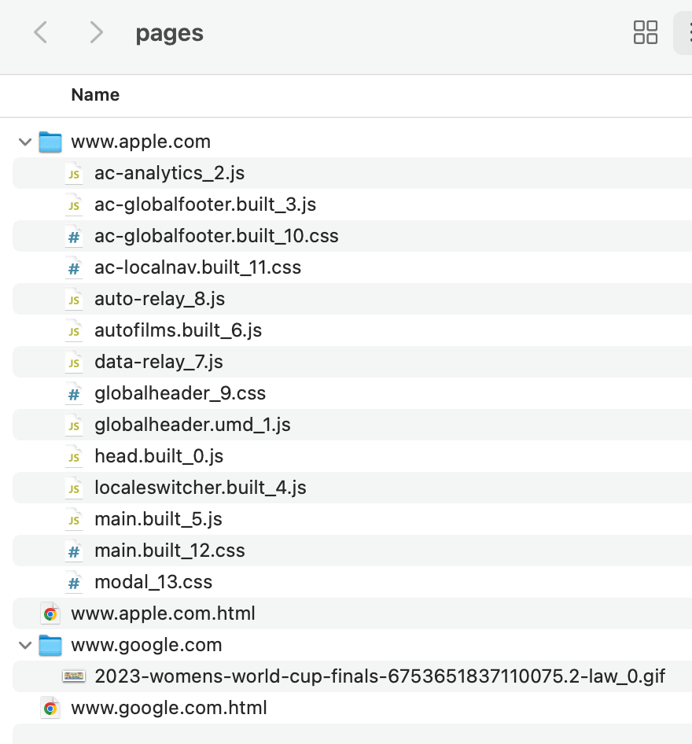

# Web scraper

This is a simple web scraper built using Python with the Requests and Beautiful Soup libraries. The program scrapes web pages using URLs and saves the entire content into a "pages" directory.


### Why Python

Python boasts a comprehensive and supportive ecosystem for web scraping. While many languages offer libraries to assist with web scraping, Python's libraries provide more advanced tools and features.

### Why Beautiful Soup

Beautiful Soup is a Python library designed for extracting data from HTML and XML files. It collaborates with various parsers to offer idiomatic ways of navigating, searching, and modifying the parse tree. While it's possible to parse HTML tags manually, Beautiful Soup often saves us hours or even days of work.


## Usage

### Running on any platform

To run the program on any environment, first build the Docker image:

```bash
cd web-scraper-python
docker build -t fetcher .
```

To execute the program and save the fetched pages to a "pages" directory on your host machine:

```bash
docker run -v $(pwd)/pages:/app/pages fetcher https://www.google.com https://www.apple.com
```
This command maps the "pages" directory in the current directory of the host to the `/app/pages` directory inside the container. Any data the script writes to `/app/pages` within the container will be saved to the corresponding directory on your host machine.

The console logs will display:

```bash
Fetching https://www.google.com...
Fetched https://www.google.com at 2023-08-20 11:32:12
  - Saved as www.google.com.html
  - Links found on the page: 12
  - Images found on the page: 1

Fetching https://www.apple.com...
Fetched https://www.apple.com at 2023-08-20 11:32:14
  - Saved as www.apple.com.html
  - Links found on the page: 119
  - Images found on the page: 0

DONE
```

The "pages" directory structure will resemble:




### Running from Python 3 environment

To run this program in a Python environment:

```bash
cd web-scraper-python
./main.py https://www.google.com https://www.apple.com
```

## Testing

Simple unit tests have been added to this package. To execute the tests from the project's root directory:

```bash
python3 -m unittest tests/test_fetcher.py
```

These tests create a mock request with basic HTML and the `www.example.com` URL, save its content to the "tests" directory, verify if everything has been saved, and then delete all these files.


## Selenium WebDriver

A version incorporating Selenium's Chrome WebDriver is available in the `fetcherSelenium.py` module. WebDriver is an open-source tool for the automated testing of web apps across various browsers, facilitating navigation to web pages, user input, JavaScript execution, and more.

Why use WebDriver?

Beautiful Soup supports only static scraping, meaning it fetches web pages directly from the server without leveraging a browser's capabilities.

If you need data present in components rendered dynamically with JavaScript, the combination of Beautiful Soup and Selenium is perfect for dynamic scraping. Selenium automates web browser interactions.

To test the Selenium version of this program:

```bash
python3 -m unittest tests/test_fetcher_selenium.py
```

Alternatively, you can uncomment lines 7 and 19-23 in main.py and run:

```bash
cd web-scraper-python
./main.py https://www.google.com https://www.apple.com
```
The content folders of the scraped pages will contain many additional files that were dynamically generated with JavaScript.


## Areas for Improvement

### 1. Avoid duplicating images
Currently, all assets are indexed by a unique identifier. This is because different files on a page may share the same name but reside in distinct directories. However, often the same image might be reused multiple times on a single page. To conserve disk space, it's better not to save multiple copies of the same image.

To address this, we can modify the program to maintain a list (or dictionary) of asset URLs. Before saving a new asset, the program can check its URL against this list. If the URL is already present, the program can use the existing image instead of saving a new copy.

### 2. Assets download log
Lines 98 and 117 in the `fetcher.py` module (which are currently commented out) output the URL of the downloaded asset to the console. We can introduce a parameter, like "-v". If this parameter is present when the program starts, the console will display a log of the downloaded files.

### 3. Handling the www subdomain
The current version doesn't account for the www subdomain. There are cases where a domain without "www" (e.g., https://google.com) functions normally, but the page might host assets that are unreachable without "www". To handle such cases more effectively, the program can include checks that account for domains both with and without the "www" prefix.

Compare:

https://google.com/images/branding/googlelogo/1x/googlelogo_color_272x92dp.png

and

https://www.google.com/images/branding/googlelogo/1x/googlelogo_color_272x92dp.png


### 4. Processing additional assetsg
At present, the program processes images (img), JavaScript, and CSS assets. The functionality could be expanded by adding the capability to process additional assets like embedded videos, frames, and more.

### 5. Handling the "picture" tag
In advanced HTML, images can be placed within the "picture" tag. This tag can contain various versions of an image represented as child "source" elements with a "srcset" attribute (e.g., for different screen resolutions). To ensure all these images are downloaded, this capability needs to be integrated into the program.

### 6. Addressing CORS
In the Selenium version of the program, many downloaded assets originate from different domains. Consequently, when opening a downloaded page from a local disk, some files might not be processed due to the CORS (Cross-Origin Resource Sharing) policy. The program can either be enhanced to handle CORS or be adjusted to avoid downloading files that are restricted by CORS.
